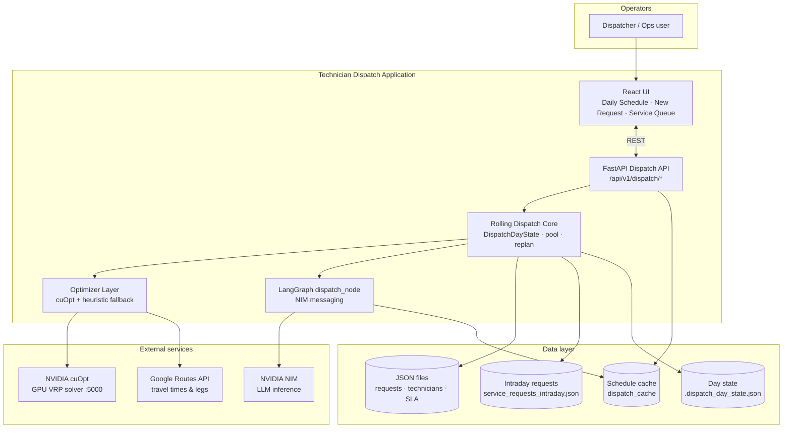

This post is a departure from the normal homelab content. No Proxmox, no Terraform, no Kubernetes. We will get back to that. But this hackathon turned into a project that kept evolving well after the two days ended, and the full arc is worth documenting.

---

## The Event

SHI has a close partnership with NVIDIA. One benefit of that relationship is access to events and programs that aren't widely available, and this hackathon was one of them. The event was co-hosted by SHI's Advanced Growth Technology (AGT) AI team and NVIDIA engineering resources: a two-day, hands-on build where teams take real-world AI use cases from SHI customers and build working solutions using NVIDIA's open source toolchain.

The format started well before the event itself. SHI team members were asked to submit customer use cases in advance, each one defined by its inputs, expected outputs, and potential NVIDIA technologies that might apply. Those submissions were compiled into a shared document that all teams could review and select from when the hackathon officially kicked off.

Nine teams competed, each with four to five members. NVIDIA provided compute through their LaunchPad platform: two servers per team, each with two H100 GPUs, for a total of four H100s per team.

---

## Team 6

| Name | Role |
|------|------|
| Matt Gladding | Enterprise Solution Engineer, SHI |
| Kindra Nicholaides | AI Software Engineer, AGT, SHI |
| Tyler Hansen | Director, Global Sales, SHI |
| Cole Vance | Inside Solution Engineer, IDCS, SHI |

A cross-functional team with an AI engineer, two sales-side technical people, and a sales director. The range of perspectives turned out to be an asset when it came to scoping the use case and thinking through what a real customer implementation would actually need to do.

---

## The Use Case: Technician Dispatch Route Optimization

From the submitted use cases, Team 6 selected Technician Dispatch Route Optimization.

The problem: field service organizations manage large technician workforces that need to be dispatched to service requests throughout the day. Doing this well requires matching the right technician to the right request based on location proximity, skill set fit, severity of the request, and time requirements. Done manually or with simple rule-based tools, it produces suboptimal schedules. Done well with an AI-backed system that can reason across all of those variables simultaneously, it can meaningfully reduce travel time, improve SLA compliance, and increase the number of requests completed per technician per day.

**Inputs:**

- Service request data: location, severity level, required skills, estimated time to complete
- Technician data: current location, skill set, working hours, current schedule

**Expected output:**

An optimized daily dispatch schedule that assigns technicians to service requests, routes them efficiently using real-world travel data, and maximizes utilization across the workforce.

The integration with Google Maps is what makes the routing real rather than approximate. Straight-line distance between a technician and a request is not the same as actual drive time, and any dispatch system that ignores traffic and road networks will produce plans that fall apart in the field.

---

## Choosing a Starting Point: The Multi-Agent Intelligent Warehouse Blueprint

Rather than starting from a blank canvas, the team mapped the use case to an existing NVIDIA Blueprint. Blueprints are reference architectures for common AI use cases: pre-built, documented, and deployable as a starting point that can be adapted rather than rebuilt from scratch.

The blueprint we landed on was the [Multi-Agent Intelligent Warehouse](https://build.nvidia.com/nvidia/multi-agent-intelligent-warehouse). At first glance, warehouse operations and technician dispatch seem unrelated. The parallel is in the underlying architecture: both involve multiple AI agents coordinating to optimize the assignment and routing of resources across a dynamic environment. The warehouse blueprint handles inventory agents, picking agents, and routing logic. Our use case handles technicians, service requests, and routing logic. The structure maps cleanly.

Adapting a blueprint meant we started with working infrastructure, a defined agent communication pattern, and a frontend, rather than building all of that ourselves. The goal was to modify the domain, not reinvent the framework.

**What we kept from the blueprint:**

- LangGraph for agent orchestration
- NVIDIA NIM for LLM inference
- FastAPI backend and React operator UI
- JSON-backed operational data under `data/`
- Deterministic pipeline nodes followed by LLM nodes in sequence

---

## The First Technical Problem: GPU Constraints

The recommended hardware for the NIM we needed to run was at least four H100 GPUs. Our servers each had two H100s, and the two servers could not be clustered for multi-GPU inference. Four GPUs on paper, but effectively two per server.

The NVIDIA team on-site pointed us toward a solution: rather than using the default model profile, we needed to select a profile that matched our actual hardware topology. NVIDIA NIMs support multiple deployment profiles that define how the model is distributed across GPUs using Tensor Parallelism (TP) and Pipeline Parallelism (PP). The default profile assumed four GPUs. We needed a profile with TP2, which distributes the model across exactly two GPUs.

To see all available profiles for the model, run the container with the `list-model-profiles` command before committing to a deployment:

```bash
docker run --rm --gpus=all \
  -e NGC_API_KEY=$NGC_API_KEY \
  nvcr.io/nim/nvidia/llama-3.3-nemotron-super-49b-v1.5:latest \
  list-model-profiles
```

This outputs a table of available profiles with their parallelism configuration, memory requirements, and throughput characteristics. We identified `vllm-bf16-tp2-pp1-62.0` as the right profile for our two-GPU setup.

**Note:** You need an NGC API key to pull and run NVIDIA NIMs. Sign up as a developer at [build.nvidia.com](https://build.nvidia.com) to get one.

---

## Getting the NIM Running

With the profile identified, we deployed the NIM in Docker. There was a significant amount of troubleshooting to get here that I will spare from the post, but the working command is below for anyone attempting something similar on a two-GPU setup:

```bash
docker run -d --rm --gpus=all \
  -e NGC_API_KEY=[YOUR-NGC-API-KEY] \
  -e NIM_MODEL_PROFILE=vllm-bf16-tp2-pp1-62.0 \
  -v "$LOCAL_NIM_CACHE":/opt/nim/.cache \
  -p 8000:8000 \
  nvcr.io/nim/nvidia/llama-3.3-nemotron-super-49b-v1.5:latest
```

The model is Llama 3.3 Nemotron Super 49B v1.5, NVIDIA's fine-tuned variant of Meta's Llama 3.3 optimized for reasoning and agentic tasks.

A few things worth noting if you are following along:

**`-e NIM_MODEL_PROFILE`**: This environment variable tells the NIM which deployment profile to use. Without it, the container attempts to auto-select a profile, which on a two-GPU server will likely choose TP1 and waste half your available compute. Set it explicitly.

**`$LOCAL_NIM_CACHE`**: Set this to a directory on the host with enough space to cache the model weights. On first run, the container downloads the weights, which takes time. Subsequent runs load from cache.

**LaunchPad pre-configuration**: The NVIDIA LaunchPad environment comes with the OS, GPU drivers, Docker, and NVIDIA Container Toolkit already installed. If you are running this on your own hardware, all of that needs to be in place before the Docker command will work.

We initially ran with a TP1 profile and watched only one of the two H100s show utilization. After switching to the TP2 profile, both GPUs lit up and inference throughput improved significantly.

---

## Deploying the Blueprint

With the NIM running and responding on port 8000, Kindra worked through the blueprint's deployment guide to bring up the full application stack. The blueprint includes backend services for agent orchestration and a frontend interface for interaction. Following the deployment guide, all components came up on the first server.

By the end of Day 1, the blueprint was running in its default warehouse configuration, talking to the Llama 3.3 Nemotron Super 49B model running on our hardware. That was the foundation. Day 2 was about replacing the domain.

---

## Planning the Adaptation

With the blueprint running, the next question was: what actually needs to change?

Rather than reading through the full codebase by hand, we fed the blueprint structure to Claude and asked it to map out every file that would need to be created or modified to swap the domain from warehouse operations to technician dispatch. This turned out to be one of the better moves we made on Day 1. Within a few minutes we had a phased implementation plan with file paths, code stubs, owner assignments, and verification steps for each phase.

A few decisions came out of that analysis that shaped everything that followed.

**Simplified agent architecture.** The warehouse blueprint uses five LLM agents. Our use case does not need five. The core logic of dispatch is deterministic: match a technician to a request based on skills and availability, look up the real drive time, check whether that time fits within the SLA window. Only the final step, generating the human-readable dispatch message and daily summary, actually benefits from an LLM. The plan simplified the agent graph to three nodes: a pipeline node for matching and routing (pure Python), a dispatch node for LLM-generated messaging (the only NIM call), and an output node that builds shareable Google Maps links and summary stats.

Fewer LLM calls means faster runs, fewer failure surfaces, and a more reliable demo.

**Google Routes API, not the legacy Directions API.** The legacy Directions API entered deprecated status in March 2025 and new GCP projects cannot rely on it. The current surface is the Routes API, which takes a `POST computeRoutes` request and returns duration and distance in a cleaner format. We wired this in via direct `httpx` calls, with no new Python dependencies since `httpx` was already in the project's requirements.

**The NIM stays unchanged.** All the GPU work from Day 1 carried forward. The route planner would talk to the same endpoint already running on the TP2 profile.

With the plan in hand, we divided the remaining work across the four team members: data layer and guardrails config, Routes API client and pipeline wiring, dispatch prompt polish, and API verification. The goal was to run those tracks in parallel on Day 2 so integration and demo rehearsal could happen in the afternoon.

---

## Day 2: The Heuristic Dispatcher

Day 2 was about going from a running blueprint to a running field service dispatch system.

The data layer came first. We built three JSON files: service requests representing an Austin-area workday (HVAC, electrical, plumbing, and specialty jobs at real addresses, each with a priority level and skill requirement), a technician roster with home addresses and skill sets, and SLA rules mapping priority levels to maximum acceptable arrival times. The dataset was intentionally designed with edge cases, including a couple of solar panel requests with no qualified technician in the roster. Realistic systems have gaps, and a good demo shows how the system handles them, not pretend they don't exist.

With data in place, the Routes API client came together. Each route call goes directly to `routes.googleapis.com/directions/v2:computeRoutes` via async `httpx`. The response returns duration in seconds and distance in meters, which we convert to minutes and kilometers. To keep the demo resilient if the API is slow or unavailable, the client falls back to deterministic mock ETAs based on address hashing rather than surfacing an error.

The three-node LangGraph flow landed by midday:

| Node | What it does | Uses LLM? |
|------|--------------|-----------|
| `pipeline_node` | Load data, match technicians to requests, compute routes, validate SLA | No |
| `dispatch_node` | Generate per-job dispatch messages and daily summary | Yes (NIM) |
| `output_node` | Build Google Maps shareable links and route summary stats | No |

The matching algorithm uses a two-phase greedy approach. Phase one walks requests in priority order and assigns each available technician their first job based on skill match. Phase two queues remaining jobs to technicians by scoring each assignment on total travel: drive to the job, complete it, drive back to depot. Routes API enriches the actual leg times after assignments are fixed.

A POST to `/api/v1/dispatch/run` returned per-technician schedules with real ETAs, SLA compliance status, and NIM-generated dispatch messages.

Beyond the routing logic, the day involved adapting both the backend and the React frontend to the field service domain: new UI pages for the daily schedule and service queue, relabeled components, and wiring the dispatch button through to the API. We also kept NeMo Guardrails in place, which the blueprint uses to constrain what the built-in chat assistant can and cannot do. For our use case that meant scoping the assistant to dispatch-related queries and preventing it from fabricating technician names, addresses, or ETAs not present in the source data.

Day 2 ran long. We stopped when we had a demoable solution, not because the work was exhausted.

---

## What the Heuristic Revealed

Once the heuristic was running, we measured it against the full Austin dataset.

SLA compliance came in at around 94%. Not bad for a greedy algorithm, but not 100%, and the failures were not random. The heuristic assigns jobs locally, one at a time, without considering the broader schedule. A technician might take a suboptimal first job because it was the first skill match in priority order, leaving a closer and better-fitting job assigned to someone who would have to drive farther. The result was a P3 call that missed its window not because no qualified technician was available, but because that technician had already been committed to a job a smarter scheduler would have sent elsewhere.

Load distribution was also uneven. Some technicians ended the day with deep queues while others with matching skills sat partially idle. Aggregate drive time across the fleet totaled around 377 minutes.

The question became obvious: what does an optimal solution look like on this dataset? And we had H100s in front of us. NVIDIA makes a GPU-accelerated solver for exactly this class of problem. More on that to come, but for now we had a demo-worthy solution.

---

## Day 3: The Demo

The third day of the event was demo day. All nine teams presented their solutions to the broader SHI and NVIDIA audience, with each team given about ten minutes.

For Team 6, Tyler ran the presentation and walked through the use case: the problem field service organizations face, the inputs and outputs, and why it was a strong fit for the NVIDIA stack. I ran the live demo, showing the dispatch system working end-to-end: data in, optimized schedule out, NIM-generated messages, Google Maps links, SLA compliance status. Kindra closed with the architecture and documentation, covering how the solution was built on top of the NVIDIA blueprint and what each technology layer was doing.

Team 6 took second place. Out of nine teams, on our first time working together, that felt like a real win.

---

## Bringing In cuOpt

*The sections below cover work I did solo over the weekend after the hackathon. NVIDIA extended access to the LaunchPad environment so I could continue developing the solution. I updated the SHI team on Monday and pushed the changes to the project's GitHub repo.*

NVIDIA cuOpt is a GPU-accelerated Vehicle Routing Problem solver. A VRP is the general form of the dispatch problem: given a set of locations to visit, a fleet of vehicles with constraints, and an objective like minimizing total travel time, find the optimal assignment and ordering. It is a well-studied combinatorial problem that gets computationally expensive at scale, which is where GPU acceleration matters.

The integration divided responsibility cleanly across three layers:

| Layer | Technology | Responsibility |
|-------|------------|----------------|
| Travel times | Google Routes API | Pairwise road travel times, N×M matrix |
| Assignment and sequencing | NVIDIA cuOpt (GPU) | VRP solve under skills, SLAs, and shifts |
| Technician messaging | NVIDIA NIM (LLM) | Human-readable dispatch text |

Each technology does one job. The LLM is not doing routing math. The optimizer is not generating prose. Google provides the road network data that cuOpt consumes.

The cuOpt service runs as a Docker container on the GPU hardware. The pipeline node builds the travel time matrix using Routes API, packages the problem (skill constraints, SLA time windows, shift hours) for cuOpt, calls the REST endpoint, and maps the solution back to technician assignments. The dispatch and output nodes are unchanged.

Feature flags control which optimizer runs, with automatic fallback to the heuristic if cuOpt is unreachable or returns an infeasible result:

```bash
DISPATCH_OPTIMIZER=cuopt
CUOPT_ENABLED=true
CUOPT_FALLBACK_TO_HEURISTIC=true
```

The results on the same Austin dataset were measurable:

| Metric | Heuristic | cuOpt |
|--------|-----------|-------|
| SLA compliance | ~94% | 100% |
| Total drive time | ~377 min | ~334 min |
| Technicians utilized | uneven | balanced |

The two solar panel requests with no qualified technician remained correctly unassigned under both optimizers. That is expected behavior, not a gap.

---

## From Batch to Rolling

The cuOpt batch optimizer solved the morning plan well. The limitation is that it treats dispatch as a static problem: run once at 8 AM, commit everyone to a full-day schedule, done.

Real field service does not work that way. Technicians complete jobs early and free up. New urgent calls come in mid-morning. The morning plan becomes stale by 10 AM. A static batch means a dispatcher is manually intervening whenever reality diverges from the schedule, which is often.

The mental model shift: instead of solving the full day once, solve only the immediate horizon. At the start of the day, assign each available technician one active job and push everything else into a pool. When a technician completes their job, re-run cuOpt with that technician at their current location against the remaining pool. New requests enter the pool and get picked up on the next solve.

```
Wave-1 (08:00)       one active job per free technician
                     remaining requests go to pool

Job complete         tech freed at job site location
                     cuOpt re-solves pool + free techs
                     board updates with new assignments

New urgent request   enters pool
                     triggers replan
                     best available tech gets assigned
```

The key detail is that replans use the technician's current location, not their morning origin. If Maria finishes a job in south Austin, the next solve knows she is in south Austin. The optimizer is working from where people actually are.

The operator UI grew alongside this: a daily schedule board with per-technician assignment cards, a service queue panel showing the unassigned pool, a new service request intake form for mid-day urgent calls, and a bulk job completion workflow that batches multiple completions into a single replan rather than triggering one per completion.

---

## Where It Landed

The finished system is three technologies doing three distinct jobs on the same H100 hardware:

- **Google Routes API** provides real road travel times. cuOpt consumes a travel time matrix, not raw addresses.
- **NVIDIA cuOpt** solves the Vehicle Routing Problem: who goes where, in what order, under skill, SLA, and shift constraints.
- **NVIDIA NIM** generates the human-readable dispatch messages once assignments are decided.

The diagram below shows how all the pieces connect at a system level:



The NVIDIA blueprint provided the scaffolding that made all of this possible: LangGraph orchestration, FastAPI backend, React UI, and a structured agent pattern. The team adapted the domain during the hackathon and built a working heuristic dispatcher. The cuOpt integration and rolling replanning came afterward, built on the same foundation.

A few things I took away from this.

The hackathon format forced real decisions quickly. When the GPU constraint problem came up, there was no time to wait. Using Claude to analyze the blueprint codebase and produce a phased adaptation plan turned an unfamiliar codebase into a concrete file-by-file task list in minutes instead of an hour. That kind of leverage matters when you have two days.

The heuristic was worth building even knowing I would eventually replace it. It validated the data layer, the Routes API integration, and the LangGraph flow before adding cuOpt complexity. The numbers it produced gave me a clear baseline and a concrete story for why cuOpt was worth the integration effort.

Having extended access to H100s changed what I considered within scope. GPU-accelerated VRP is not something you would normally reach for in a weekend side project, but with the compute already provisioned and cuOpt available as a containerized REST service, it became a realistic scope of work. The rolling replanning architecture followed naturally from seeing where the batch approach fell short.

---

## A Few Thank Yous

First, to SHI and NVIDIA: thank you for the opportunity. Events like this are rare, and I walked away with a much sharper understanding of what customers face when they are trying to build with these technologies. It is easy to talk about NIM, cuOpt, and LangGraph at an abstract level. Spending two days with them under real time pressure, on real hardware, with a real use case to solve, is a different kind of education.

To Kindra, Cole, and Tyler: you three made this work. We came in from different roles and parts of the business, had no rehearsal as a team, and still managed to divide the work cleanly and move fast. Kindra, the AI and architecture depth you brought was the backbone of what we built. Cole and Tyler, having teammates who could engage on both the technical side and the customer narrative at the same time made the demo land the way it did. I appreciate all of it.

SHI has people, many considerably smarter than me, who can help make projects like this real for your organization. If you want to talk through what something like this could look like for your use case, feel free to reach out.

---

*This is post 6 of an ongoing series. [View all posts](/posts/).*
